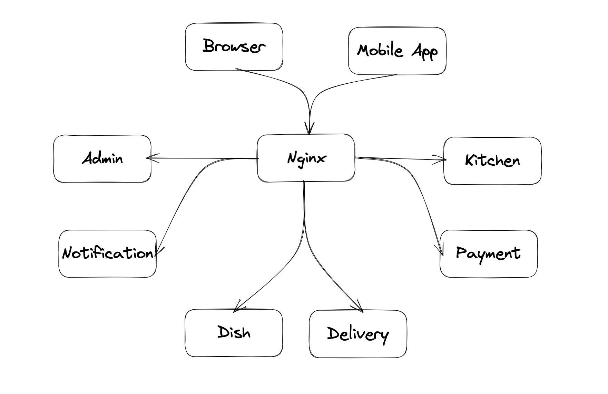

# Project "Fast Food Delivery"

## Architecture

---
## Service

---
### Customer wishes:

- Has a catalog of dishes.
- Can accept customer orders on the site. Or through an application downloaded by customers.
- Provides the client with courier delivery. The client. can control the position of the courier.
- Provides couriers with applications where they can report on orders, update their position.
- Has an admin panel in the form of a web application, where you can arrange the delivery of products, as well as see the profit.
___

## Environment before launch

[Intellij IDEA](https://www.jetbrains.com/idea/download/ )

[JDK 18](https://www.oracle.com/java/technologies/downloads/#java17)

## Technology stack:

